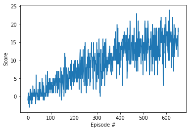

# Project 1: Navigation

***<u>Note</u>***: read `README.md` first to gain some intuition about this project. In this file, `Report.md` I will only focus on the **implementation** of my idea, **results** and some **ideas** to **improve** the performance of the agent. 

## 1. Implementation

The core idea that help my implemented agent to successfully solve this complicated environment is *[Deep Q-learning](https://storage.googleapis.com/deepmind-media/dqn/DQNNaturePaper.pdf)*, a reinforcement learning algorithm first introduced by Deepmind (Mnih et al.) in 2015. 

Although there are many versions of improved *Deep Q-learning* like *[Double Deep Q-network](https://arxiv.org/pdf/1509.06461.pdf)*, *[Prioritized Replay](https://arxiv.org/pdf/1509.06461.pdf)* or *[Dueling Q-network](https://arxiv.org/pdf/1511.06581.pdf)*, I believe that the original version of *Deep Q-learning* is enough for the agent to successfully solve this environment. This is because of the simplicity of the environment: Instead of proving learning agents with images as the states of agents, the environment provides agents with 37-dimensional vectors as states. This makes the learning process much **easier** in comparison with the environments used when evaluating the superior performances of *Double Deep Q-network*, *Prioritized Replay* or *Dueling Q-network* over that of original *Deep Q network*. 

### 1.1 Deep Q-learning

The main idea behind the algorithm used in this project is using the nonlinear function performed by Deep Neural Network with 2 hidden layers of 64 units with ReLU (Rectified Linear Units) function as activation to estimate the Q (state-action value) function in Reinforcement Learning. 

There are 2 novel points in this algorithm to take care about:

  * *Experience Replay*

      * At first, the algorithm starts with initializing the memory $D$ to store $N$ transitions, which is randomized and updated every step.

        The newly randomized action in the transition (state+action ⇒ reward+new_state) is selected with the continuingly updated policy (this can be $\epsilon$-greedy or greedy policy).

        The memory $D$ is then used as the labeled data in training the Deep Neural Network to estimate the  function, but this is only within a step, after that step, the memory would be updated.

  * *Target Network*

      * The main idea behind this target network is to prevent the  Deep Neural Network (which is the core of deep Q-learning) to diverge during the training session.

        This target network is used to estimate the future reward (from step ***j+1***). Plus with the reward ***r*** at step ***j***, it give the estimate Q-value for the action chosen by the policy ***(y_j)***. This  Q-value is then passed into the loss function of the Deep Neural Network, the effort to minimize the mean-squared error loss would then optimize the performance of the deep network in estimating Q-values.

        This network is updated every step. In other word, if we consider each time the parameters in Deep Neural Network update it produce a new network and then we store all those networks into a list, the current network is at index ***i***, then the index of current target network is ***i-1***.

### 1.2 Hyper-parameters

|             Hyperparameter              | Value  |
| :-------------------------------------: | :----: |
|               Batch size                |   64   |
|               Buffer size               |  1e5   |
|             Discount factor             |  0.99  |
|    Soft update of target parameters     | 0.001  |
|              Learning rate              | 0.0005 |
|   Update interval (after every steps)   |   4    |
|       maximum number of episodes        |  2000  |
| maximum number of timesteps per episode |  1000  |
|        starting value of epsilon        |  1.0   |
|        minimum value of epsilon         |  0.01  |
|              epsilon decay              | 0.995  |

### 1.3 Model architecture

|         Layer         | number of units | Activation function |
| :-------------------: | :-------------: | :-----------------: |
|      Input layer      |       37        |                     |
| $1^{st}$ hidden layer |       64        |        ReLU         |
| $2^{nd}$ hidden layer |       64        |        ReLU         |
|     Output layer      |        4        |                     |

## 2. Result

*<u>**Note:**</u>* The agent only stop learning when its average score over 100 recently continuous episodes reaches $15.0$. This is also a challenge for my designed agent.

## 3. Further Improvement

* Improved versions of DQN:
  * Although the original version of DQN perform quite well in this environment as it can reach the average score of 15.0 in just 654 episodes, I believe, from perspectives of a learner, *[Double Deep Q-network](https://arxiv.org/pdf/1509.06461.pdf)*, *[Prioritized Replay](https://arxiv.org/pdf/1509.06461.pdf)* or *[Dueling Q-network](https://arxiv.org/pdf/1511.06581.pdf)* can also reach this performance but need more episodes, so more computational cost. To validate this hypothesis, I will implement these ideas in a near future.

* Applying some searching strategies (*[Bergstra and Bengio, 2012](https://www.jmlr.org/papers/volume13/bergstra12a/bergstra12a.pdf)*; *[Petro Liashchynskyi and Pavlo Liashchynskyi, 2019](https://arxiv.org/pdf/1912.06059.pdf))* for best-performed hyperparameters will also help agents much in learning to solve this environment.

